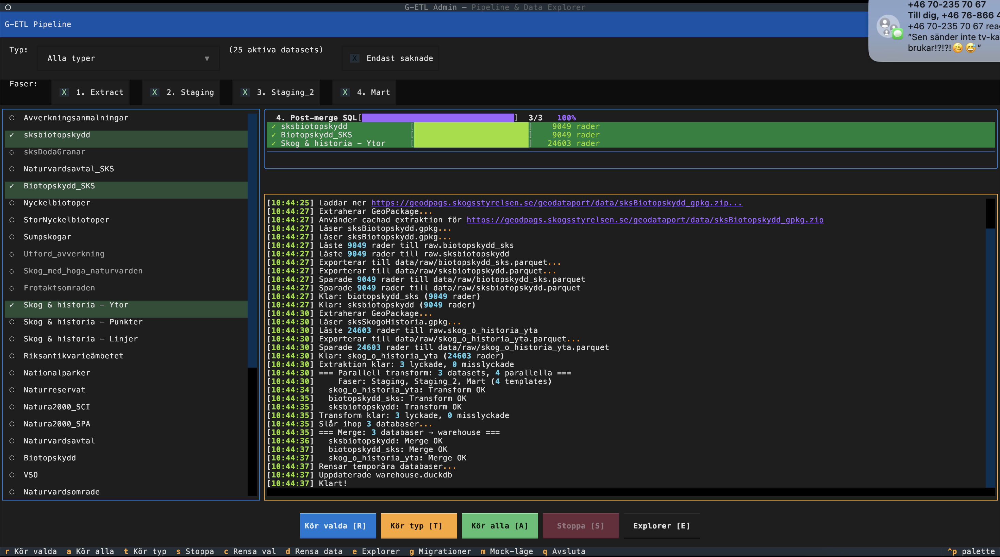
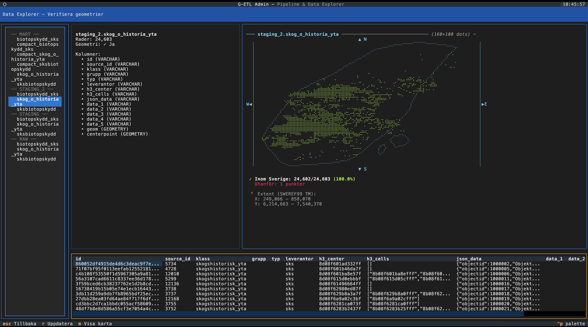

# G-ETL – DuckDB ETL-stack för svenska geodata

En ETL-stack för svenska geodata med DuckDB som analytisk motor, H3 spatial indexering och plugin-baserad datahämtning.




## Snabbstart

### Docker (enklast)

**Linux/macOS:**
```bash
# Ladda ner setup-script och kör
curl -sL https://raw.githubusercontent.com/10gbrand/g-etl/main/setup.sh | bash

# Starta TUI
docker compose run --rm admin
```

**Windows (PowerShell):**
```powershell
# Ladda ner setup-script och kör
Invoke-WebRequest -Uri "https://raw.githubusercontent.com/10gbrand/g-etl/main/setup.bat" -OutFile "setup.bat"
.\setup.bat

# Starta TUI
docker compose run --rm admin
```

Detta skapar följande struktur lokalt:
```
./config/datasets.yml   # Redigera för att välja datakällor
./sql/migrations/       # SQL-templates (kan anpassas)
./input_data/           # Lokala geodatafiler (GeoPackage, Shapefile, etc.)
./data/                 # Resultat sparas här
```

### TUI (lokal installation)

```bash
# Klona och installera
git clone https://github.com/10gbrand/g-etl.git
cd g-etl
pip install uv
uv sync

# Starta TUI
uv run python -m g_etl.admin.app

# Eller med task runner
task admin:run
```

### CLI

```bash
# Kör hela pipelinen (extract + transform)
task pipeline:run

# Endast extract (hämta data)
task pipeline:extract

# Endast transform (SQL-transformationer)
task pipeline:transform

# Specifikt dataset
task pipeline:dataset -- naturreservat

# Datasets av viss typ
task pipeline:type -- skogsstyrelsen_gpkg

# Exportera resultat
task pipeline:export:gpkg      # GeoPackage (bäst för QGIS)
task pipeline:export:parquet   # GeoParquet
task pipeline:export:fgb       # FlatGeobuf
task pipeline:export:geojson   # GeoJSON
task pipeline:export:html      # Interaktiv HTML-karta
task pipeline:export:kepler    # CSV för Kepler.gl
```

### QGIS Plugin

Kör G-ETL direkt i QGIS med full integration:

1. Ladda ner `g_etl_qgis-<version>.zip` från [Releases](https://github.com/10gbrand/g-etl/releases)
2. I QGIS: **Tillägg** → **Hantera och installera tillägg** → **Installera från ZIP**
3. Välj zip-filen och klicka **Installera tillägg**

Se [QGIS Plugin dokumentation](qgis_plugin/README.md) för mer information.

### Förbyggd binär

Ladda ner kompilerad binär utan Python-beroenden:

```bash
# macOS (Apple Silicon)
curl -LO https://github.com/10gbrand/g-etl/releases/latest/download/g_etl-macos-arm64.tar.gz

# Linux x86_64
curl -LO https://github.com/10gbrand/g-etl/releases/latest/download/g_etl-linux-x86_64.tar.gz

# Linux ARM64
curl -LO https://github.com/10gbrand/g-etl/releases/latest/download/g_etl-linux-arm64.tar.gz

# Packa upp och kör
tar -xzf g_etl-*.tar.gz
./g_etl
```

## Dokumentation

| Dokumentation | Beskrivning |
| ------------- | ----------- |
| [docs/architecture.md](docs/architecture.md) | Pipeline-översikt, parallell arkitektur, DuckDB-scheman |
| [docs/development.md](docs/development.md) | Lägga till dataset och plugins, SQL-generator, makron |
| [config/readme.md](config/readme.md) | Dataset-konfiguration och field_mapping |
| [config/datasets.md](config/datasets.md) | Lista över alla dataset |
| [docker/readme.md](docker/readme.md) | Docker-images, compose-filer, Huey |
| [qgis_plugin/README.md](qgis_plugin/README.md) | QGIS Plugin-dokumentation |

## Dataset

Dataset konfigureras i `config/datasets.yml` med `field_mapping:` för alla transformationer.
Se [config/readme.md](config/readme.md) för detaljerad dokumentation och [config/datasets.md](config/datasets.md) för lista över alla dataset.

```yaml
datasets:
  - id: sksbiotopskydd
    name: Biotopskydd SKS
    description: Biotopskydd från Skogsstyrelsen
    typ: skogsstyrelsen_gpkg
    plugin: zip_geopackage
    url: https://geodpags.skogsstyrelsen.se/.../sksBiotopskydd_gpkg.zip
    enabled: true
    field_mapping:
      source_id_column: $beteckn   # $prefix = kolumnreferens
      klass: biotopskydd           # utan prefix = literal sträng
      grupp: $Biotyp               # hämta värde från kolumn "Biotyp"
      typ: $Naturtyp               # hämta värde från kolumn "Naturtyp"
      leverantor: sks              # literal sträng
```

## Komma igång

### Förutsättningar

- Python 3.11+
- UV (pakethanterare)
- Docker (valfritt)

### Installation

#### Alternativ 1: Docker

```bash
curl -sL https://raw.githubusercontent.com/10gbrand/g-etl/main/setup.sh | bash
docker compose run --rm admin
```

#### Alternativ 2: Förbyggd binär

```bash
# Välj rätt arkitektur och ladda ner
curl -LO https://github.com/10gbrand/g-etl/releases/latest/download/g_etl-linux-arm64.tar.gz
tar -xzf g_etl-*.tar.gz
./g_etl
```

#### Alternativ 3: Från källkod

```bash
task py:install
task admin:run
```

### DuckDB CLI

```bash
# Öppna Harlequin (DuckDB GUI)
task hq

# Eller direkt med duckdb
duckdb data/warehouse.duckdb

# Exempel-queries
SELECT COUNT(*) FROM mart.h3_cells;
SELECT * FROM mart.sksbiotopskydd LIMIT 10;
```
