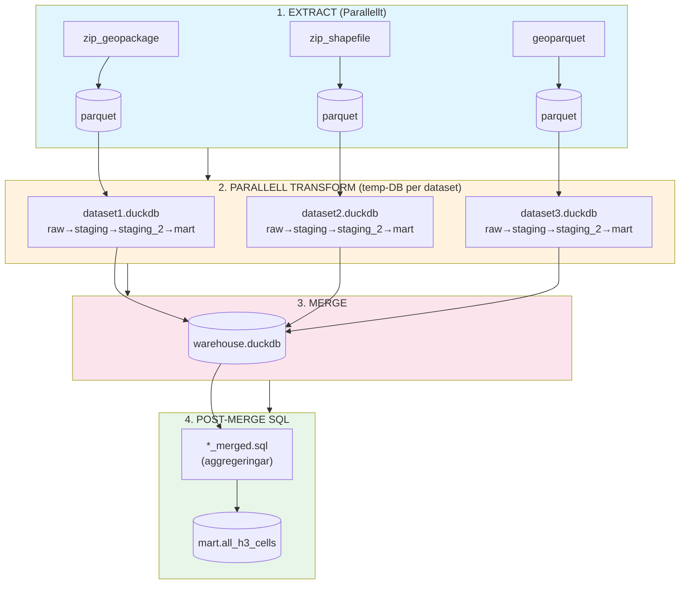

# G-ETL – DuckDB ETL-stack för svenska geodata

En ETL-stack för svenska geodata med DuckDB som analytisk motor, H3 spatial indexering och plugin-baserad datahämtning.

## Pipeline-översikt



### Parallell arkitektur

Varje dataset processas i en **egen temporär DuckDB-fil** för äkta parallelism utan fillåsning:

| Fas        | Parallelism        | Beskrivning                              |
| ---------- | ------------------ | ---------------------------------------- |
| Extract    | `cpu_count()`      | I/O-bound, alla kärnor                   |
| Transform  | `cpu_count() // 2` | CPU-bound, DuckDB paralleliserar internt |
| Merge      | Sekventiell        | Kombinerar temp-DBs                      |
| Post-merge | Sekventiell        | Aggregeringar över alla datasets         |

## Detaljerat pipeline-flöde

### Steg 1: Extract (Plugins → raw.*)

Plugins laddar ner och läser in geodata till `raw`-schemat i DuckDB.

| Plugin | Källa | Format |
|--------|-------|--------|
| `zip_geopackage` | URL eller lokal fil | Zippad GeoPackage |
| `zip_shapefile` | URL eller lokal fil | Zippad Shapefile |
| `wfs` | OGC WFS-tjänst | GML/JSON |
| `geoparquet` | URL, S3 eller lokal fil | GeoParquet |
| `lantmateriet` | Lantmäteriets API | JSON |
| `mssql` | Microsoft SQL Server | ODBC |

**Resultat:** `raw.{dataset}` – rådata med originalkolumner och geometri.

### Steg 2: Staging (SQL + H3 → staging.*)

#### 2a. Makron från migrering
`sql/migrations/004_staging_procedure.sql` definierar makron för H3-beräkning och
geometrihantering. Dessa installeras vid `task db:migrate`.

#### 2b. Genererad SQL
`SQLGenerator.staging_sql()` genererar staging-SQL baserat på `datasets.yml`.
Staging-tabellen skapas med:

- Validerad geometri (`geom`)
- Metadata: `_imported_at`, `_geom_md5`, `_attr_md5`, `_json_data`
- Centroid i WGS84: `_centroid_lat`, `_centroid_lng`
- **H3-index** (beräknas direkt i SQL via DuckDB H3 extension):
  - `_h3_index` (res 13, ~43 m²) – centroid-cell
  - `_h3_cells` (res 11, ~2149 m²) – alla celler inom polygonen
- Käll-ID: `_source_id_md5`

H3-beräkningen sker med DuckDB:s community extension:
```sql
h3_latlng_to_cell_string(lat, lng, 13) AS _h3_index,
to_json(h3_polygon_wkt_to_cells_string(wkt, 11)) AS _h3_cells
```

**Resultat:** `staging.{dataset}` – standardiserad data med H3-index.

### Steg 3: Staging_2 (SQL → staging_2.*)

Normaliserar alla dataset till en enhetlig struktur.

#### 3a. Genererad SQL
`SQLGenerator.staging2_sql()` genererar normaliserings-SQL baserat på `datasets.yml`.
Konfiguration i `staging_2:`-blocket styr hur data mappas:

```sql
SELECT
    _source_id_md5 AS id,
    source_id,           -- Käll-ID (t.ex. beteckn)
    klass,               -- Typ av skydd (biotopskydd, naturreservat, etc.)
    grupp,               -- Undergrupp
    typ,                 -- Specifik typ
    leverantor,          -- Dataleverantör (sks, nvv, sgu)
    h3_center,           -- H3-cell för centroid
    h3_cells,            -- Alla H3-celler inom polygonen
    json_data,           -- Originaldata som JSON
    data_1..data_5,      -- Extra datafält
    geom
FROM staging.{dataset}
```

**Resultat:** `staging_2.{dataset}` – normaliserade dataset med enhetlig struktur.

### Steg 4: Mart (SQL → mart.*)

Aggregerar alla dataset till en gemensam H3-tabell.

#### 4a. End SQL (zzz_end)
`sql/mart/zzz_end/01_end.sql` körs sist och skapar `mart.h3_cells`:

- Kombinerar alla `staging_2.*`-tabeller
- En rad per H3-cell
- Kolumner per dataset med klassificering

**Resultat:** `mart.h3_cells` – aggregerad tabell redo för analys och export.

## Transform-pipeline

Transformationer körs parallellt med separata temp-databaser per dataset:

```
1. Extract (parallellt)
   └── Plugins → parquet-filer (en per dataset)

2. Parallell Transform (temp-DB per dataset)
   ├── dataset1.duckdb ──┐
   ├── dataset2.duckdb ──┼── Kör alla templates: 004→005→006→007
   └── dataset3.duckdb ──┘

3. Merge
   └── Kombinera alla temp-DBs → warehouse.duckdb

4. Post-merge SQL
   └── sql/migrations/*_merged.sql → Aggregeringar över alla datasets
```

### SQL-templates

Templates (`*_template.sql`) körs automatiskt per dataset:

| Fil                                       | Fas       | Beskrivning               |
| ----------------------------------------- | --------- | ------------------------- |
| `004_staging_transform_template.sql`      | Staging   | Validering, MD5, H3-index |
| `005_staging2_normalisering_template.sql` | Staging_2 | Normaliserad struktur     |
| `006_mart_h3_cells_template.sql`          | Mart      | Exploderade H3-celler     |
| `007_mart_compact_h3_cells_template.sql`  | Mart      | Kompakterade H3-celler    |

### Post-merge SQL (`*_merged.sql`)

Filer med suffix `_merged.sql` körs EFTER merge för aggregeringar:

```sql
-- sql/migrations/100_all_h3_cells_merged.sql
CREATE OR REPLACE TABLE mart.all_h3_cells AS
SELECT * FROM mart.naturreservat
UNION ALL SELECT * FROM mart.biotopskyddsomraden
UNION ALL SELECT * FROM mart.vattenskyddsomraden;
```

## DuckDB-scheman

| Schema | Syfte |
|--------|-------|
| `raw` | Rå ingesterad data direkt från plugins |
| `staging` | Validerad geometri, metadata och H3-index |
| `staging_2` | Normaliserade dataset med enhetlig struktur |
| `mart` | Aggregerade tabeller (h3_cells) redo för analys och export |

## Projektstruktur

```
g-etl/
├── config/
│   ├── datasets.yml       # Dataset-konfiguration
│   └── settings.py        # Inställningar (H3, CRS, parallelism)
├── plugins/               # Datakälla-plugins
│   ├── base.py            # Basklass för plugins
│   ├── zip_geopackage.py  # Zippad GeoPackage
│   ├── zip_shapefile.py   # Zippad Shapefile
│   ├── wfs.py             # OGC WFS-tjänster
│   ├── geoparquet.py      # GeoParquet-filer
│   ├── lantmateriet.py    # Lantmäteriets API
│   └── mssql.py           # Microsoft SQL Server
├── sql/
│   └── migrations/        # Alla SQL-filer
│       ├── 001_db_extensions.sql           # Init: extensions
│       ├── 002_db_schemas.sql              # Init: scheman
│       ├── 003_db_makros.sql               # Init: makron
│       ├── 004_staging_transform_template.sql    # Template: staging
│       ├── 005_staging2_normalisering_template.sql # Template: staging_2
│       ├── 006_mart_h3_cells_template.sql        # Template: mart
│       ├── 007_mart_compact_h3_cells_template.sql # Template: mart
│       └── 100_*_merged.sql                # Post-merge aggregeringar
├── scripts/
│   ├── sql_generator.py   # Genererar SQL från templates
│   ├── admin/             # Textual TUI-applikation
│   │   ├── screens/
│   │   │   ├── pipeline.py     # Pipeline-körning
│   │   │   └── explorer.py     # Data-utforskare
│   │   └── services/
│   │       └── pipeline_runner.py  # Parallell pipeline-körare
│   ├── pipeline.py        # CLI pipeline-runner
│   └── export_h3.py       # Export av H3-data
├── data/
│   ├── raw/               # Parquet-filer från extract
│   ├── temp/              # Temporära per-dataset DBs
│   └── warehouse.duckdb   # Slutlig databas
└── logs/                  # Pipeline-loggar
```

## Komma igång

### Förutsättningar

- Python 3.11+
- UV (pakethanterare)
- Docker (valfritt)

### Installation

```bash
# Installera dependencies
task py:install

# Kör databasmigrationer
task db:migrate
```

### Köra pipelinen

```bash
# Hela pipelinen (extract + transform)
task run

# Endast extract
task pipeline:extract

# Endast transform (staging + staging_2 + mart SQL)
task pipeline:transform

# Specifikt dataset
task pipeline:dataset -- sksbiotopskydd

# Datasets av viss typ
task pipeline:type -- skogsstyrelsen_gpkg

# Lista tillgängliga typer
task pipeline:types
```

### Exportera H3-data

```bash
# CSV för Kepler.gl
task pipeline:export:kepler

# GeoJSON med H3-polygoner
task pipeline:export:geojson

# Interaktiv HTML-karta (Folium)
task pipeline:export:html

# GeoParquet för QGIS/analys
task pipeline:export:parquet
```

### Admin TUI

```bash
# Starta TUI
task admin:run

# Med mockdata (för test)
task admin:mock
```

### DuckDB CLI

```bash
# Öppna REPL
task db:cli

# Exempel-queries
SELECT COUNT(*) FROM mart.h3_cells;
SELECT * FROM mart.sksbiotopskydd LIMIT 10;
```

### Migrationer

SQL-baserat migreringssystem som fungerar med både DuckDB och PostgreSQL.

```bash
# Visa status för migrationer
task db:migrate:status

# Kör väntande migrationer
task db:migrate

# Rulla tillbaka senaste migreringen
task db:migrate:rollback

# Skapa ny migrering
task db:migrate:create -- "add_new_table"
```

Migreringsfiler använder `-- migrate:up` och `-- migrate:down` för att separera up/down-SQL:

```sql
-- Migration: add_new_table
-- migrate:up
CREATE TABLE mart.analytics (
    id INTEGER PRIMARY KEY,
    name VARCHAR
);

-- migrate:down
DROP TABLE mart.analytics;
```

Migrationer spåras i tabellen `_migrations` och kan även hanteras via TUI (tryck **G** i Pipeline-screenen).

## Dataset

Dataset konfigureras i `config/datasets.yml` med staging- och staging_2-konfiguration:

```yaml
datasets:
  - id: sksbiotopskydd
    name: Biotopskydd SKS
    description: Biotopskydd från Skogsstyrelsen
    plugin: zip_geopackage
    url: https://geodpags.skogsstyrelsen.se/.../sksBiotopskydd_gpkg.zip
    enabled: true
    # Staging: raw → staging med H3
    staging:
      source_id_column: objectid  # Kolumn för käll-ID hash
    # Staging_2: staging → staging_2 normalisering
    staging_2:
      klass: biotopskydd          # Klassificering
      grupp: Biotyp               # Kolumnreferens för grupp
      typ: Naturtyp               # Kolumnreferens för typ
      leverantor: sks             # Dataleverantör
      source_id_column: beteckn   # Kolumn för source_id

  - id: nationalparker
    name: Nationalparker
    plugin: zip_shapefile
    url: https://geodata.naturvardsverket.se/.../NP.zip
    enabled: true
    staging:
      source_id_column: NVRID
    staging_2:
      klass: nationalpark
      leverantor: nvv
```

### Staging-konfiguration

| Fält | Beskrivning |
|------|-------------|
| `source_id_column` | Kolumn att använda för `_source_id_md5` hash |

### Staging_2-konfiguration

| Fält | Beskrivning |
|------|-------------|
| `klass` | Klassificering (biotopskydd, naturreservat, etc.) |
| `grupp` | Undergrupp - kan vara literal sträng eller kolumnnamn |
| `typ` | Specifik typ - kan vara literal sträng eller kolumnnamn |
| `leverantor` | Dataleverantör (sks, nvv, sgu) |
| `source_id_column` | Kolumn för source_id i output |

## H3 Spatial Index

Projektet använder [H3](https://h3geo.org/) för spatial indexering:

| Inställning | Värde | Cellstorlek |
|-------------|-------|-------------|
| `H3_RESOLUTION` | 13 | ~43 m² (centroid) |
| `H3_POLYFILL_RESOLUTION` | 11 | ~2149 m² (polyfill) |

H3-celler möjliggör snabba spatial joins och aggregeringar utan geometriberäkningar.

## Parallelism

Parallelliteten auto-detekteras baserat på antal CPU-kärnor (`config/settings.py`):

```python
MAX_CONCURRENT_EXTRACTS = cpu_count()      # I/O-bound: alla kärnor
MAX_CONCURRENT_SQL = cpu_count() // 2      # CPU-bound: halva (DuckDB paralleliserar internt)
```

Temporära databaser sparas i `data/temp/` och rensas automatiskt efter merge.

## Koordinatsystem

**OBS:** DuckDB:s spatial extension har en bugg med EPSG-koder. Använd PROJ4-strängar:

```sql
-- Korrekt (PROJ4)
ST_Transform(geom,
    '+proj=utm +zone=33 +ellps=GRS80 +towgs84=0,0,0,0,0,0,0 +units=m +no_defs',
    '+proj=longlat +datum=WGS84 +no_defs')

-- Fel (EPSG) - ger felaktiga koordinater!
ST_Transform(geom, 'EPSG:3006', 'EPSG:4326')
```

## Utveckling

### Lägga till nytt dataset

1. Lägg till konfiguration i `config/datasets.yml` med `staging` och `staging_2` block
2. Kör pipelinen - SQL genereras automatiskt baserat på konfigurationen

Staging- och staging_2-SQL genereras nu automatiskt via `SQLGenerator` baserat på
konfiguration i datasets.yml. Du behöver inte längre skapa SQL-filer för varje dataset.

### SQL-generator

Pipelinen använder `scripts/sql_generator.py` för att generera staging-SQL:

```python
from scripts.sql_generator import SQLGenerator

generator = SQLGenerator()

# Generera staging SQL
sql = generator.staging_sql("sksbiotopskydd", {
    "source_id_column": "objectid"
})

# Generera staging_2 SQL
sql = generator.staging2_sql("sksbiotopskydd", {
    "klass": "biotopskydd",
    "grupp": "Biotyp",        # Kolumnreferens
    "typ": "Naturtyp",        # Kolumnreferens
    "leverantor": "sks",
    "source_id_column": "beteckn"
})
```

### Makron från migrering 004

Staging-SQL använder makron definierade i `sql/migrations/004_staging_procedure.sql`:

| Makro | Beskrivning |
|-------|-------------|
| `validate_geom(geom)` | Validera och fixa geometri |
| `wgs84_centroid_lat(geom)` | Centroid latitud i WGS84 |
| `wgs84_centroid_lng(geom)` | Centroid longitud i WGS84 |
| `h3_centroid(geom)` | H3-cell för centroid (res 13) |
| `h3_polyfill(geom)` | Alla H3-celler inom polygon (res 11) |
| `json_without_geom(json)` | Ta bort geometri från JSON |

### Lägga till ny plugin

1. Skapa `plugins/{namn}.py` som ärver från `SourcePlugin`
2. Implementera `extract(config, conn, on_log, on_progress)`
3. Registrera i `plugins/__init__.py`

Se `plugins/README.md` för detaljerad dokumentation.
