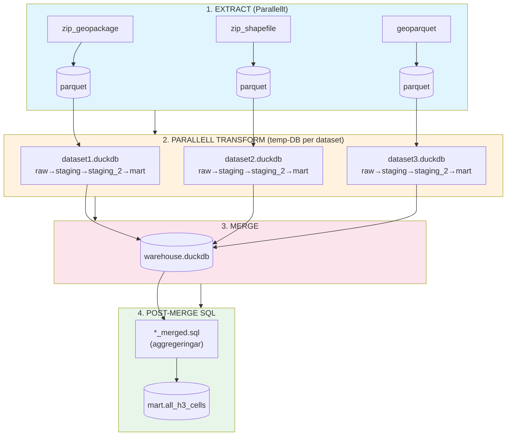

# Arkitektur

Pipeline-översikt och detaljerad dokumentation av G-ETL:s arkitektur.

## Pipeline-översikt



## Parallell arkitektur

Varje dataset processas i en **egen temporär DuckDB-fil** för äkta parallelism utan fillåsning:

| Fas        | Parallelism        | Beskrivning                              |
| ---------- | ------------------ | ---------------------------------------- |
| Extract    | `cpu_count()`      | I/O-bound, alla kärnor                   |
| Transform  | `cpu_count() // 2` | CPU-bound, DuckDB paralleliserar internt |
| Merge      | Sekventiell        | Kombinerar temp-DBs                      |
| Post-merge | Sekventiell        | Aggregeringar över alla datasets         |

```text
┌─────────────────────────────────────────────────────────────────┐
│  EXTRACT (parallellt, cpu_count() workers)                      │
├─────────────────────────────────────────────────────────────────┤
│  ┌──────────┐  ┌──────────┐  ┌──────────┐  ┌──────────┐         │
│  │ dataset1 │  │ dataset2 │  │ dataset3 │  │ dataset4 │  ...    │
│  └────┬─────┘  └────┬─────┘  └────┬─────┘  └────┬─────┘         │
│       │             │             │             │               │
│       ▼             ▼             ▼             ▼               │
│  ┌──────────┐  ┌──────────┐  ┌──────────┐  ┌──────────┐         │
│  │ .parquet │  │ .parquet │  │ .parquet │  │ .parquet │         │
│  └────┬─────┘  └────┬─────┘  └────┬─────┘  └────┬─────┘         │
└───────┼─────────────┼─────────────┼─────────────┼───────────────┘
        │             │             │             │
        ▼             ▼             ▼             ▼
┌─────────────────────────────────────────────────────────────────┐
│  TRANSFORM (parallellt, cpu_count()//2 workers)                 │
├─────────────────────────────────────────────────────────────────┤
│  ┌──────────┐  ┌──────────┐  ┌──────────┐  ┌──────────┐         │
│  │ temp1.db │  │ temp2.db │  │ temp3.db │  │ temp4.db │  ...    │
│  │ 004→007  │  │ 004→007  │  │ 004→007  │  │ 004→007  │         │
│  └────┬─────┘  └────┬─────┘  └────┬─────┘  └────┬─────┘         │
└───────┼─────────────┼─────────────┼─────────────┼───────────────┘
        │             │             │             │
        └─────────────┴──────┬──────┴─────────────┘
                             ▼
┌─────────────────────────────────────────────────────────────────┐
│  MERGE (sekventiell)                                            │
│  └── warehouse.duckdb ← alla temp-DBs                           │
└───────────────────────────────┬─────────────────────────────────┘
                                ▼
┌─────────────────────────────────────────────────────────────────┐
│  POST-MERGE (sekventiell)                                       │
│  └── *_merged.sql → aggregeringar över alla datasets            │
└─────────────────────────────────────────────────────────────────┘
```

## Detaljerat pipeline-flöde

### Steg 1: Extract (Plugins → raw.*)

Plugins laddar ner och läser in geodata till `raw`-schemat i DuckDB.

| Plugin | Källa | Format | status |
|--------|-------|--------|--------|
| `zip_geopackage` | URL eller lokal fil | Zippad GeoPackage | Klart |
| `zip_shapefile` | URL eller lokal fil | Zippad Shapefile | Klart |
| `wfs` | OGC WFS-tjänst | GML/JSON | Plan |
| `geoparquet` | URL, S3 eller lokal fil | GeoParquet | Plan |
| `lantmateriet` | Lantmäteriets API | JSON | Plan |
| `mssql` | Microsoft SQL Server | ODBC | Plan |

**Resultat:** `raw.{dataset}` – rådata med originalkolumner och geometri.

### Steg 2: Staging (SQL + H3 → staging.*)

#### 2a. Makron från migrering
`sql/migrations/003_db_makros.sql` definierar makron för H3-beräkning och
geometrihantering. Dessa installeras automatiskt när pipelinen körs.

#### 2b. Genererad SQL
`004_staging_transform_template.sql` renderas med värden från `field_mapping:` i `datasets.yml`.
Staging-tabellen skapas med:

- Validerad geometri (`geom`)
- Metadata: `_imported_at`, `_geom_md5`, `_attr_md5`, `_json_data`
- Centroid i WGS84: `_centroid_lat`, `_centroid_lng`
- **H3-index** (beräknas direkt i SQL via DuckDB H3 extension):
  - `_h3_index` (res 13, ~43 m²) – centroid-cell
  - `_h3_cells` (res 11, ~2149 m²) – alla celler inom polygonen
- Käll-ID: `_source_id_md5`

H3-beräkningen sker med DuckDB:s community extension:
```sql
h3_latlng_to_cell_string(lat, lng, 13) AS _h3_index,
to_json(h3_polygon_wkt_to_cells_string(wkt, 11)) AS _h3_cells
```

**Resultat:** `staging.{dataset}` – standardiserad data med H3-index.

### Steg 3: Staging_2 (SQL → staging_2.*)

Normaliserar alla dataset till en enhetlig struktur.

#### 3a. Genererad SQL
`005_staging2_normalisering_template.sql` renderas med värden från `field_mapping:` i `datasets.yml`.
Konfigurationen styr hur data mappas:

```sql
SELECT
    _source_id_md5 AS id,
    source_id,           -- Käll-ID (t.ex. beteckn)
    klass,               -- Typ av skydd (biotopskydd, naturreservat, etc.)
    grupp,               -- Undergrupp
    typ,                 -- Specifik typ
    leverantor,          -- Dataleverantör (sks, nvv, sgu)
    h3_center,           -- H3-cell för centroid
    h3_cells,            -- Alla H3-celler inom polygonen
    json_data,           -- Originaldata som JSON
    data_1..data_5,      -- Extra datafält
    geom
FROM staging.{dataset}
```

**Resultat:** `staging_2.{dataset}` – normaliserade dataset med enhetlig struktur.

### Steg 4: Mart (SQL → mart.*)

Aggregerar alla dataset till en gemensam H3-tabell.

#### 4a. Mart-templates

`006_mart_h3_cells_template.sql` och `007_mart_compact_h3_cells_template.sql` körs per dataset och skapar:

- `mart.{dataset}` – exploderade H3-celler med geometri
- `mart.{dataset}_compact` – kompakterade H3-celler

#### 4b. Post-merge SQL (`*_merged.sql`)

Efter merge körs `*_merged.sql`-filer för aggregeringar över alla datasets:

- Kombinerar alla dataset-tabeller
- Skapar gemensamma vyer/tabeller

**Resultat:** `mart.*` – aggregerade tabeller redo för analys och export.

## Transform-pipeline

Transformationer körs parallellt med separata temp-databaser per dataset:

```
1. Extract (parallellt)
   └── Plugins → parquet-filer (en per dataset)

2. Parallell Transform (temp-DB per dataset)
   ├── dataset1.duckdb ──┐
   ├── dataset2.duckdb ──┼── Kör alla templates: 004→005→006→007
   └── dataset3.duckdb ──┘

3. Merge
   └── Kombinera alla temp-DBs → warehouse.duckdb

4. Post-merge SQL
   └── sql/migrations/*_merged.sql → Aggregeringar över alla datasets
```

### SQL-templates

Templates (`*_template.sql`) körs automatiskt per dataset:

| Fil                                       | Fas       | Beskrivning               |
| ----------------------------------------- | --------- | ------------------------- |
| `004_staging_transform_template.sql`      | Staging   | Validering, MD5, H3-index |
| `005_staging2_normalisering_template.sql` | Staging_2 | Normaliserad struktur     |
| `006_mart_h3_cells_template.sql`          | Mart      | Exploderade H3-celler     |
| `007_mart_compact_h3_cells_template.sql`  | Mart      | Kompakterade H3-celler    |

```text
Template-rendering:

┌─────────────────────────────────────────────────────────────────┐
│  datasets.yml                                                   │
│  └── field_mapping:                                             │
│        source_id_column: $beteckn                               │
│        klass: biotopskydd                                       │
│        grupp: $Biotyp                                           │
└───────────────────────────────┬─────────────────────────────────┘
                                │
                                ▼
┌─────────────────────────────────────────────────────────────────┐
│  SQLGenerator.render_template()                                 │
│  ├── Läs template: 004_staging_transform_template.sql           │
│  ├── Ersätt {{ dataset_id }} → "sksbiotopskydd"                 │
│  ├── Ersätt {{ source_id_column }} → "beteckn"                  │
│  ├── Ersätt {{ klass }} → "biotopskydd"                         │
│  └── Ersätt {{ grupp_expr }} → "COALESCE(s.Biotyp::VARCHAR,'')" │
└───────────────────────────────┬─────────────────────────────────┘
                                │
                                ▼
┌─────────────────────────────────────────────────────────────────┐
│  Renderad SQL                                                   │
│  └── CREATE TABLE staging.sksbiotopskydd AS ...                 │
└─────────────────────────────────────────────────────────────────┘
```

### Post-merge SQL (`*_merged.sql`)

Filer med suffix `_merged.sql` körs EFTER merge för aggregeringar:

```sql
-- sql/migrations/100_all_h3_cells_merged.sql
CREATE OR REPLACE TABLE mart.all_h3_cells AS
SELECT * FROM mart.naturreservat
UNION ALL SELECT * FROM mart.biotopskyddsomraden
UNION ALL SELECT * FROM mart.vattenskyddsomraden;
.
.
```

## DuckDB-scheman

| Schema      | Syfte                                                      |
| ----------- | ---------------------------------------------------------- |
| `raw`       | Rå ingesterad data direkt från plugins                     |
| `staging`   | Validerad geometri, metadata och H3-index                  |
| `staging_2` | Normaliserade dataset med enhetlig struktur                |
| `mart`      | Aggregerade tabeller (h3_cells) redo för analys och export |

```text
Dataflöde genom scheman (per dataset):

┌─────────────────────────────────────────────────────────────────┐
│  raw.{dataset}                                                  │
│  └── Originaldata från plugin (alla kolumner, geometri)        │
└───────────────────────────────┬─────────────────────────────────┘
                                │ 004_staging_transform_template.sql
                                ▼
┌─────────────────────────────────────────────────────────────────┐
│  staging.{dataset}                                              │
│  ├── Validerad geometri (geom)                                  │
│  ├── Metadata (_imported_at, _geom_md5, _attr_md5)              │
│  ├── H3-index (_h3_index, _h3_cells)                            │
│  └── JSON-data (_json_data)                                     │
└───────────────────────────────┬─────────────────────────────────┘
                                │ 005_staging2_normalisering_template.sql
                                ▼
┌─────────────────────────────────────────────────────────────────┐
│  staging_2.{dataset}                                            │
│  ├── Normaliserade fält (klass, grupp, typ, leverantor)         │
│  ├── H3 (h3_center, h3_cells)                                   │
│  └── Extra data (data_1..data_5)                                │
└───────────────────────────────┬─────────────────────────────────┘
                                │ 006/007_mart_*_template.sql
                                ▼
┌─────────────────────────────────────────────────────────────────┐
│  mart.{dataset}                                                 │
│  └── En rad per H3-cell med geometri                            │
│                                                                 │
│  mart.{dataset}_compact                                         │
│  └── Kompakterade H3-celler (färre rader)                       │
└─────────────────────────────────────────────────────────────────┘
```

## Projektstruktur

```
g-etl/
├── config/
│   └── datasets.yml       # Dataset-konfiguration
├── src/g_etl/             # Python-paket
│   ├── settings.py        # Inställningar (H3, CRS, parallelism)
│   ├── plugins/           # Datakälla-plugins
│   │   ├── base.py        # Basklass för plugins
│   │   ├── zip_geopackage.py
│   │   ├── zip_shapefile.py
│   │   ├── wfs.py
│   │   ├── geoparquet.py
│   │   ├── lantmateriet.py
│   │   └── mssql.py
│   ├── admin/             # Textual TUI-applikation
│   │   ├── screens/       # TUI-skärmar
│   │   └── services/
│   │       └── pipeline_runner.py  # GEMENSAM parallell pipeline-logik
│   ├── migrations/        # Migreringssystem
│   │   ├── cli.py
│   │   └── migrator.py
│   ├── pipeline.py        # CLI (anropar PipelineRunner)
│   ├── sql_generator.py   # Genererar SQL från templates
│   └── export.py          # Export av data
├── sql/
│   └── migrations/        # Alla SQL-filer
│       ├── 001_db_extensions.sql           # Init: extensions
│       ├── 002_db_schemas.sql              # Init: scheman
│       ├── 003_db_makros.sql               # Init: makron
│       ├── 004_staging_transform_template.sql    # Template: staging
│       ├── 005_staging2_normalisering_template.sql # Template: staging_2
│       ├── 006_mart_h3_cells_template.sql        # Template: mart
│       ├── 007_mart_compact_h3_cells_template.sql # Template: mart
│       └── 100_*_merged.sql                # Post-merge aggregeringar
├── data/
│   ├── raw/               # Parquet-filer från extract
│   ├── temp/              # Temporära per-dataset DBs
│   └── warehouse.duckdb   # Slutlig databas
└── logs/                  # Pipeline-loggar
```

**CLI och TUI delar samma `PipelineRunner`** i `src/g_etl/admin/services/pipeline_runner.py`.
Det finns ingen duplicerad pipeline-logik.

```text
CLI/TUI-arkitektur:

┌──────────────────────┐     ┌──────────────────────┐
│  CLI (pipeline.py)   │     │  TUI (admin/app.py)  │
│  └── task run        │     │  └── Textual UI      │
└──────────┬───────────┘     └──────────┬───────────┘
           │                            │
           └────────────┬───────────────┘
                        ▼
┌─────────────────────────────────────────────────────────────────┐
│  PipelineRunner (admin/services/pipeline_runner.py)             │
│  ├── run_parallel_extract()    # Parallell datahämtning        │
│  ├── run_parallel_transform()  # Parallell SQL-transformering  │
│  ├── merge_databases()         # Kombinera temp-DBs            │
│  └── run_merged_sql()          # Post-merge aggregeringar      │
└───────────────────────────────┬─────────────────────────────────┘
                                │
                                ▼
┌─────────────────────────────────────────────────────────────────┐
│  Plugins + SQLGenerator + Migrator                              │
│  └── Gemensam logik för all pipeline-körning                    │
└─────────────────────────────────────────────────────────────────┘
```

## H3 Spatial Index

Projektet använder [H3](https://h3geo.org/) för spatial indexering:

| Inställning | Värde | Cellstorlek |
|-------------|-------|-------------|
| `H3_RESOLUTION` | 13 | ~43 m² (centroid) |
| `H3_POLYFILL_RESOLUTION` | 11 | ~2149 m² (polyfill) |

H3-celler möjliggör snabba spatial joins och aggregeringar utan geometriberäkningar.

## Parallelism

Parallelliteten auto-detekteras baserat på antal CPU-kärnor (`src/g_etl/settings.py`):

```python
MAX_CONCURRENT_EXTRACTS = cpu_count()      # I/O-bound: alla kärnor
MAX_CONCURRENT_SQL = cpu_count() // 2      # CPU-bound: halva (DuckDB paralleliserar internt)
```

Temporära databaser sparas i `data/temp/` och rensas automatiskt efter merge.

## Koordinatsystem

**OBS:** DuckDB:s spatial extension har en bugg med EPSG-koder. Använd PROJ4-strängar:

```sql
-- Korrekt (PROJ4)
ST_Transform(geom,
    '+proj=utm +zone=33 +ellps=GRS80 +towgs84=0,0,0,0,0,0,0 +units=m +no_defs',
    '+proj=longlat +datum=WGS84 +no_defs')

-- Fel (EPSG) - ger felaktiga koordinater!
ST_Transform(geom, 'EPSG:3006', 'EPSG:4326')
```
